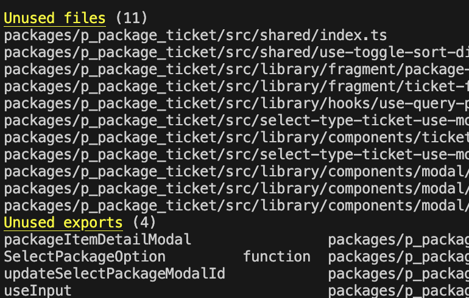
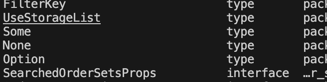
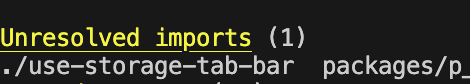

오랜만에 글을 쓰는 것 같다.  
그동안 회사일도 많았지만 사이드 프로젝트로 인해 너무 바빠서 블로그 신경을 못 쓴것 같다.

지금도 시간이 많지 않으니 최근 유용하게 사용한 패키지 하나를 후딱 소개하려 한다.

## Knip

<a href="https://knip.dev" target="_blank">Knip</a>

이미 잘 쓰는 사람도 있겠지만 이 패키지의 목적은  
`Declutter your JavaScript & TypeScript projects` 즉  
코드 정리를 도와주는 아주 유용한 도구다.

주로 사용하는 lint 나 다른 잡다한 도구로도 어느정도 안쓰는 코드를 정리 할 수 있지만  
이 도구는 안쓰는 파일,type,interface,enum 등등 현재 코드에서 죽은 코드를  
깔끔하게 알려주기 떄문에 주기적으로 프로젝트 코드를 정리할때 아주 유용하다.

뭐 사용법은 홈페이지에 있으니 자세히 차근차근 보면서 따라하면 되고  
나같은 경우 대부분의 프로젝트가 전부 monorepo 형식이기 때문에  
이에 맞는 설정을 만들어 사용했다.

간단하게 루트에 `knip.config.ts` 설정파일을 작성하고

아래 예시처럼

```typescript
export default {
  workspaces: {
    "packages/a-package": {
      entry: ["src/entry/index.ts"],
      project: ["src/**/*.{js,ts,tsx}"],
    },
    "packages/b-package": {
      entry: ["src/entry/index.ts"],
      project: ["src/**/*.{js,ts,tsx}"],
    },
  },
  project: "tsconfig.json",
  ignoreDependencies: ["@swc/helpers", "react", "react-dom", "core-js"],
  rules: {
    binaries: "error",
    dependencies: "error",
    devDependencies: "error",
    exports: "error",
    files: "warn",
    nsExports: "error",
    nsTypes: "error",
    types: "error",
    enumMembers: "error",
    unlisted: "off",
  },
  paths: {
    "@/*": ["./src/*"],
    "~/*": ["./src/*"],
    "src/*": ["./src/*"],
  },
  ignore: [
    "**/*.test.{ts,tsx}",
    "**/*.spec.{ts,tsx}",
    "**/*.stories.{ts,tsx}",
    "**/*.d.ts",
    "**/node_modules/**",
    "**/dist/**",
    "**/build/**",
    "**/storybook-static/**",
    "**/jest.config.{js,ts}",
  ],
}
```

실제 설정파일은 훨씬 복잡하지만..  
기본 예시로 대략 이렇게 필요한 설정을 계속 추가 하면 된다.

더 많은 설정은 홈페이지에서 확인하면 된다. 🥹

## 그래서 결과물은?

monorepo 같은 경우 위처럼 workspace 를 설정해서  
`pnpm knip` 이런식으로 한번에 검사하거나,  
`pnpm knip --workspace packages/a-package` 이런식으로 특정 패키지만  
검사하는 것도 가능하다.

한번 돌려보면







스샷이 뒤죽박죽인데  
하여튼 이런식으로 사용되지 않는 파일이나 함수,변수,interface 등등  
현재 프로젝트에서 죽은 코드들을 싹 알려준다.

> 주의할 점은 위 설정파일에서 있는 `entry` 배열 기준으로 정리하기 때문에  
> `entry` 설정을 정확히 해야 정확한 결과를 가져온다.

`module federation` 을 사용하는 경우에도 export 하는 파일의 이름,  
Barrel 방식 이라면 내보내는 index.ts 를 entry 에 넣어주면  
잘 작동한다.

봄이 가고 이제 여름이 시작되니 더 더워지기 전에  
코드 청소 한번 하는게 좋지 않을까
